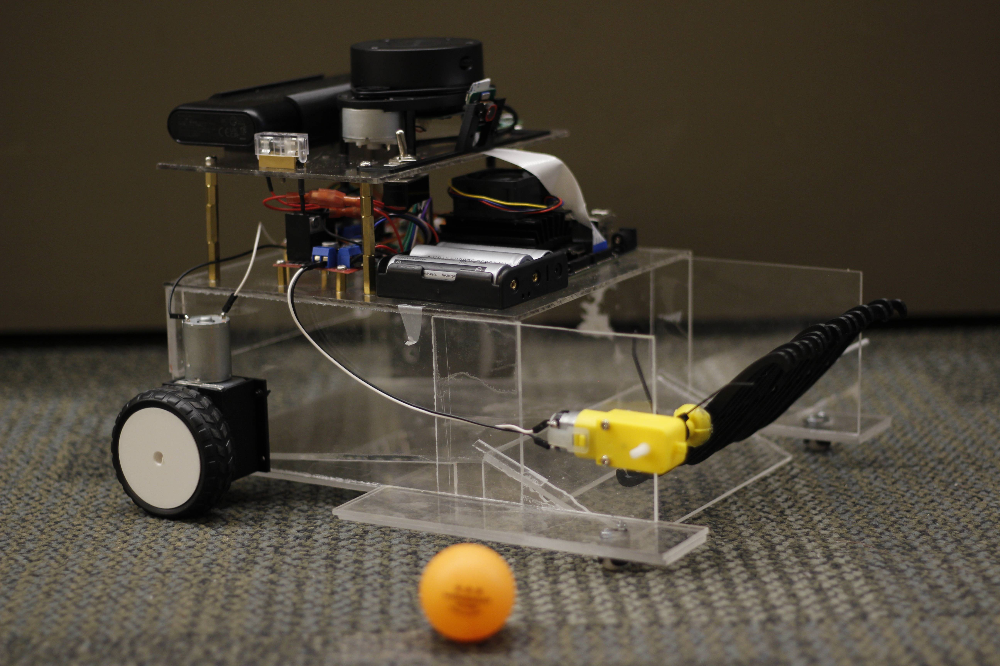

# 🤖 Autonomous Ping Pong Collector

---

## 📷 Bot Showcase

---

## 🎥 Demo

  

  ▶️ <a href="demo/demo_1.mp4"><strong>Demo 1   </strong></a>
  ▶️ <a href="demo/demo_2.mp4"><strong>Demo 2   </strong></a>
  ▶️ <a href="demo/demo_3.mp4"><strong>Demo 3   </strong></a>

<video width="800" controls autoplay loop muted>
  <source src="demo/demo_2.mp4" type="video/mp4">
  Your browser does not support the video tag.
</video>

## 👋 Introduction
Introducing the Autonomous Ping Pong Collector, a robot that uses machine learning and computer vision to locate rogue ping pong balls (preferably orange). No more quests to find lost balls after the game, because this autonomous collector maneuvers around obstacles, making ball kid duties a relic of the past. The objective of this project is to show that boring tasks can be automated so that we can focus on more important things, such as throwing matches or fighting with our friends over an iffy serve.

---

## 📝 Material/Component List

| Item | Quantity |
|------|----------|
| NVIDIA Jetson Nano 4GB | 1 |
| SD-Card | 1 |
| Anker Portable Battery (5V/4A) | 1 |
| Arduino Nano | 1 |
| Arducam IMX519 | 1 |
| Slamtec RPLIDAR A1M8 | 1 |
| TT Motor ((3-6v)(150-160 mA)) | 1 |
| DC12V Electric Motor Reversible High Torque Turbo Worm Gear Box Reduction Electric Motor 5/6/20/40 62RPM | 1 |
| L298n Driver 5v (logic)/36ma (logic) | 2 |
| 9g Servo(4.8-6v/100-250mA) | 1 |
| PCA9685 (2.3-5.5/25mA(per servo)) | 1 |
| 3mm Clear Cast Acrylic 3mm 12"x12" | 6 |
| 3mm Clear Cast Acrylic 3mm 12"x24" | 2 |
| 18650 2600 mAh 3.7 Volt Batteries, 2 Pack | 4 |
| 18650 Battery Charger, 4 Slots | 1 |
| 3 Pack 3.1A QC Micro USB Cable | 1 |
| 16 Channel PWM Servo Driver | 1 |
| 5 PCs SG90 Servo Motor Kit | 1 |
| Keeyes L298n and Motor Kit | 1 |
| M3 x 10mm Phillips Screws (10 Pcs) | 1 |
| M3 x 20mm Phillips Screws (10 Pcs) | 1 |
| M3 x 25mm Phillips Screws (10 Pcs) | 1 |
| M3 Machine Hex Nut (10 Pcs) | 2 |
| M2.5 x 6mm Phillips Screws (10 Pcs) | 1 |
| M2.5 x 20mm Phillips Screws (10 Pcs) | 1 |
| M2.5 Machine Hex Nut | 2 |
| Pololu Ball Caster 1/2" Plastic | 2 |
| Pololu Ball Caster Wheel 3/8" Metal | 2 |
| SparkFun 22AWG Red Wire | 1 |
| SparkFun 22AWG Black Wire | 1 |
| 4x 18650 Battery Holder | 1 |
| 2 Oz Applicator Bottle | 5 |
| Weldon 4 1/4 Pint Fast Set | 1 |
| Hitachi Brass Standoff Spaces | 7 |
| 20mm Fuse (2 Pack) – 3 Amp | 1 |
| SPST Toggle Switch | 1 |
| 20mm Fuse Holder | 1 |

---

## 🚀 Future Works + Improvements

- **Increase LiDAR clearance margin**: Play with the trigger threshold slightly above 450 mm (e.g., 475 mm) or implement a dynamic lateral offset when an obstacle is detected off-center to prevent shallow‐angle collisions. (Physical relocation to a more central area of the bot for the LiDAR can help too)

- **Refine Scoop mechanism**: Adjust the sweeper arm angle, and add a longer more flexible lip to the scoop to better catch the ball on first contact. Or even reconsider a new ball catching mechanism such as a vacuum-based suction collector.

- **Migration from Jetson Nano 4GB to Jetson Orin Nano**: The Jetson Nano 4GB has limitations in memory and computational power, restricting us to using the MobileNet SSD v2 model for object detection. While the MobileNet model works, the more sophisticated models like YOLOv8 will provide better accuracy and performance, but they also require more available computing resources. Moving to the Jetson Orin Nano would allow you to implement the more advanced models and provide real-time inference and scale in the future. NVIDIA has also officially discontinued the Jetson Nano platform so there won't be any software updates or long-term support. We recommend switching to the Jetson Orin Nano platform to provide better real-time performance and to allow for future compatibility with emerging technologies.

- **Integrate IMUs and Wheel Encoders**: Currently, our robot is using a reactive obstacle avoidance via LiDAR. While this is an effective method for local navigation, it does not provide the robot with any global understanding or planning capability. By equipping the robot with Inertial Measurement Units (IMUs) and wheel encoders, you would be able to obtain odometry data to enable SLAM (Simultaneous Localization and Mapping) and path planning algorithms. This would allow the robot to map its environment and navigate intelligently and efficiently while retrieving ping pong balls.

---

## ✅ Conclusion

All in all, we accomplished our goal of fabricating a robot capable of simultaneously avoiding obstacles while detecting and collecting ping pong balls. However, integrating these features posed several challenges, including memory limitations on the Jetson Nano and design issues such as balls deflecting off the sweeper blades. We went through multiple design iterations before arriving at the current model, which resolved many of the physical issues we initially encountered. Despite these obstacles, the experience gained and lessons learned throughout the project will serve as valuable guidance for our future engineering endeavors.

<h2 align="center">Acknowledgement</h2>

  Special thanks to: 
  <b>Eugenio D.</b> 
  <b>Jose J.</b> 
  <b>Daniel A.</b> 
  <b>Jacob B.</b>

